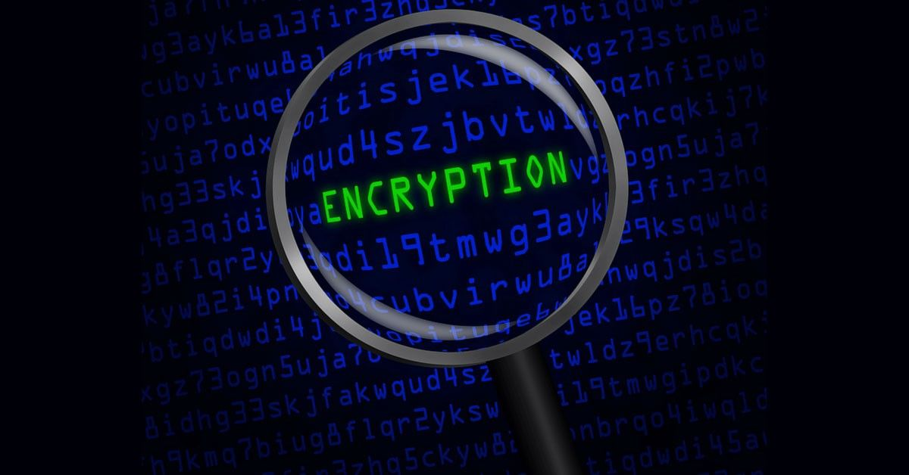
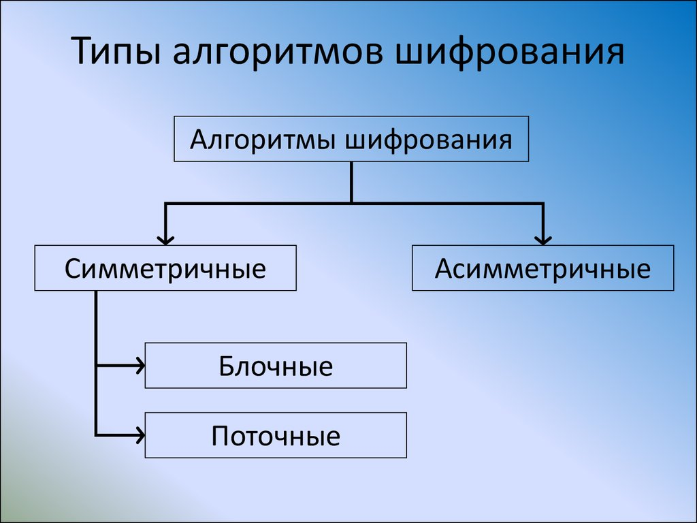
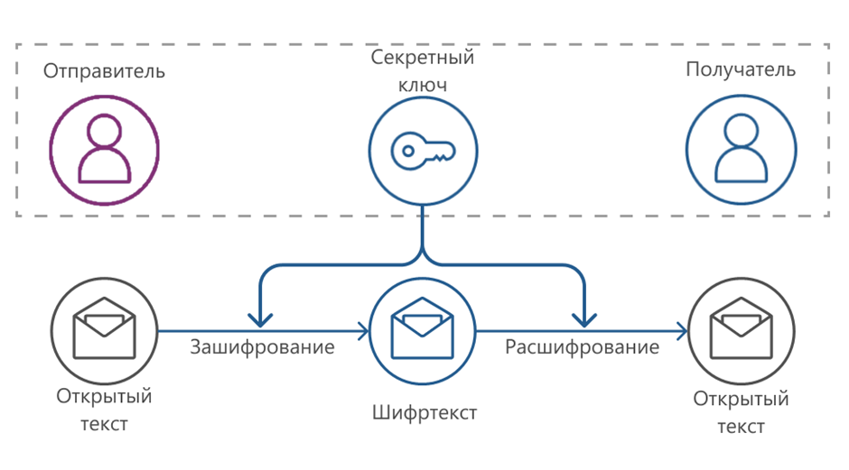
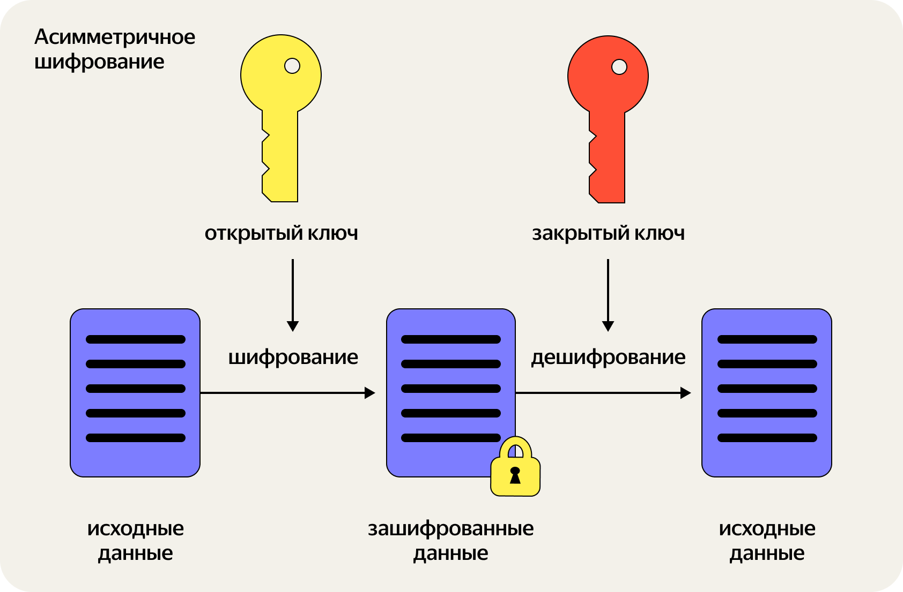
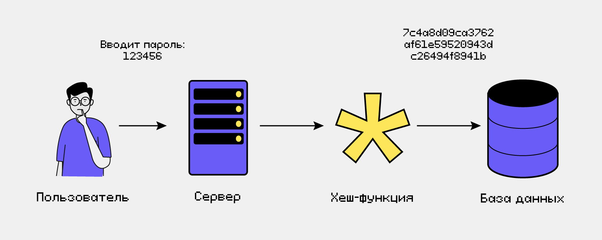
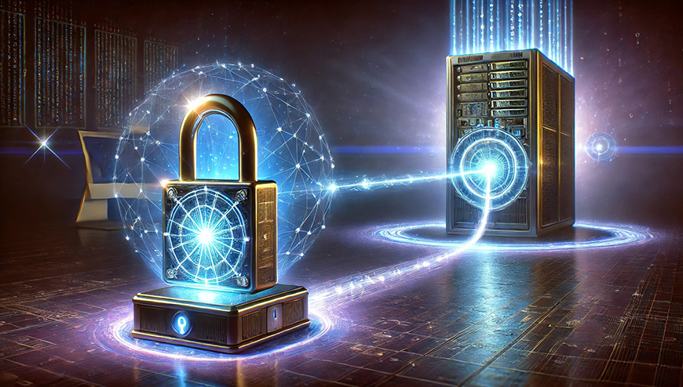

---
## Author
author:
  name: Сидорова Александра Андреевна
  email: 1032256488@rudn.ru
  affiliation:
      name: Российский университет дружбы народов
      country: Российская Федерация
      postal-code: 117198
      city: Москва
      address: ул. Миклухо-Маклая, д. 6

## Title
title: "Современные методы криптографии"
subtitle: "Анализ актуальных криптографических решений"
date: today
date-format: "2026-04-01"
---

# Содержание

- Введение
- Актуальность криптографии сегодня
- Основные виды криптографических методов
- Примеры современных алгоритмов
- Практическое применение
- Вызовы и перспективы
- Заключение и выводы

# Докладчик

:::::::::::::: {.columns align=center}
::: {.column width="70%"}

  * Сидорова Алексанжра Андреевна
  * Студентка 1 курса
  * Бизнес-информатика
  * Российский университет дружбы народов им. П. Лумумбы

:::
::: {.column width="30%"}

:::
::::::::::::::

# Цель, гипотеза, задачи исследования

- Цель: изучить и систематизировать современные методы криптографии, оценить их надёжность и перспективы.
- Задачи:
  - Изучить основные виды криптографии.
  - Проанализировать популярные алгоритмы.
  - Рассмотреть примеры применения.
  - Оценить устойчивость к атакам.
  - Определить направления развития.

# Актуальность криптографии сегодня. 
 
:::::::::::::: {.columns align=center}
::: {.column width="70%"}

- Рост числа кибератак и утечек данных.
- Важность защиты информации в цифровую эпоху.
- Роль криптографии в обеспечении конфиденциальности, целостности и аутентификации данных.
- Тенденции: рост использования облачных сервисов, IoT, блокчейна.

:::
::: {.column width="30%"}

:::
::::::::::::::

# Объект и предмет исследования

- Объект: современные методы криптографии.
- Предмет: принципы работы, области применения и эффективность современных криптографических алгоритмов.

# Практическая значимость работы

:::::::::::::: {.columns}
::: {.column width="40%"}

:::
::: {.column width="60%"}

* Применение криптографии в:
  * Банковском секторе
  * Государственных системах
  * Корпоративной безопасности
  * Персональной безопасности

:::
::::::::::::::

# Содержание исследования: методы и виды криптографии
 
:::::::::::::: {.columns align=center}
::: {.column width="60%"}

## Методы криптографии  

- Шифрование
- Стеганография
- Кодирование

:::
::: {.column width="40%"}

:::
::::::::::::::

# Типы шифрования: 

:::::::::::::: {.columns}
::: {.column width="40%"}

:::
::: {.column width="60%"}

## Симметричное шифрование:

- Принцип: один ключ для шифрования и расшифровки.
- Алгоритмы: AES, DES.

## Асимметричное шифрование:

- Принцип: пара ключей.
- Алгоритмы: RSA, ECC.

:::
::::::::::::::

# Хеш‑функции:

:::::::::::::: {.columns align=center}
::: {.column width="60%"}

- Принцип: преобразование данных в фиксированный хеш.
- Алгоритмы: SHA‑256.
- Применение: проверка целостности данных, пароли.

:::
::: {.column width="40%"}

:::
::::::::::::::

# Примеры современных алгоритмов

- AES: используется в Wi‑Fi, VPN
- RSA: создание цифровой подписи, электронные платежи, системы аунтенфикации
- ECC: протоколы безопасности связи, смарт-часы и строенные схемы
- SHA‑256: хеш‑функция для блокчейна и сертификатов
- Постквантовые алгоритмы: NTRU, McEliece

# Анализ и практическая значимость результатов

- Устойчивость к атакам:
 - Симметричные:
AES (Advanced Encryption Standard) — Считается стойким даже к мощным атакам.
 - Однако есть и уязвимости:
Слабое место симметричного шифрования— обмен ключомю.
 - Асимметричные:
RSA (Rivest-Shamir-Adleman) — основанный на сложности факторизации больших чисел. 
ECC (Elliptic Curve Cryptography) — основанный на эллиптических кривых.
 - Однако есть и уязвимости:
Повторное использование открытого ключа — одна из наиболее критичных уязвимостей. 

# Постквантовые методы шифрования 

:::::::::::::: {.columns align=center}
::: {.column width="60%"}

Постквантовые методы шифрования(постквантовая криптография) — это алгоритмы, устойчивые к атакам квантовых компьютеров. 
Стойкость постквантового шифрования гарантируется математическими доказательствами секретности каждого из алгоритмов.

:::
::: {.column width="40%"}

:::
::::::::::::::

# Рекомендации  

:::::::::::::: {.columns align=center}
::: {.column width="60%"}

- Использовать гибридные схемы (AES + RSA).
- Внедрять ECC для  мобильных приложений.
- Готовиться к переходу на постквантовую криптографию.

:::
::: {.column width="40%"}

:::
::::::::::::::

# Общее заключение и выводы

- Современные методы криптографии обеспечивают высокий уровень защиты данных.
- Симметричные алгоритмы  для шифрования больших объёмов, асимметричные — для обмена ключами и подписи.
- Постквантовая криптография — ключевое направление будущего.

