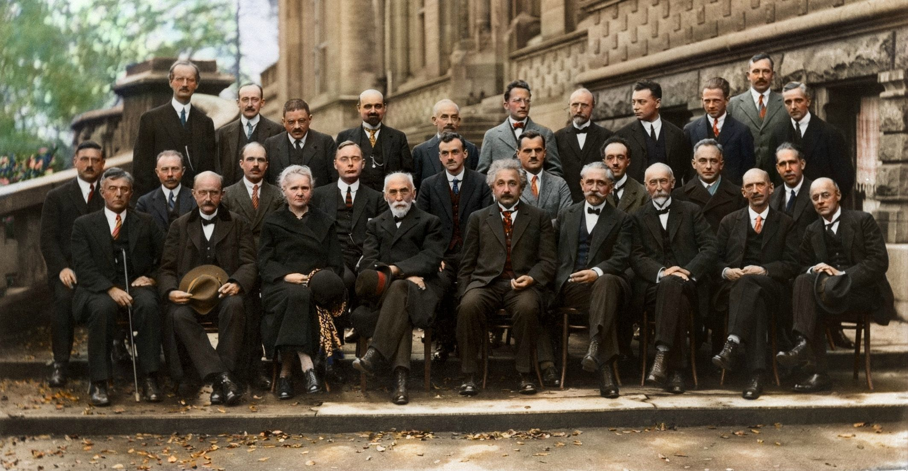

---
## Author
author:
  name: Сидорова Александра Андреевна
  email: 1032256488@rudn.ru
  affiliation:
    - name: Российский университет дружбы народов
      country: Российская Федерация
      postal-code: 117198
      city: Москва
      address: ул. Миклухо-Маклая, д. 6

## Title
title: "Современные методы криптографии"
subtitle: "Анализ актуальных криптографических решений"
license: "CC BY"
---

# Цель работы

 Цель доклада: показать связь между архитектурными решениями (конвейеры, SIMD, аппаратные ускорители) и эффективной реализацией шифрования. 

# Введение 

Сегодня криптография — не только математика, но и вызов компьютерной архитектуре.

#  Актуальность

Объём данных, облака, IoT, квантовые угрозы. Криптоалгоритмы работают на уровне тактов и кэшей.

#  Симметричное шифрование — архитектурный взгляд 

AES (Advanced Encryption Standard): операции SubBytes (S-Box), ShiftRows, MixColumns, AddRoundKey.
Проблема для CPU: S-Box — нелинейная замена, в программной реализации требует доступа к таблице (TLB, кэш-промахи). Время зависит от данных → угроза cache-timing атак (например, Prime+Probe).
Аппаратное решение: AES-NI (Intel/AMD) — отдельные инструкции aesenc, aesenclast. Конвейер не останавливается, нет кэш-утечек.
Альтернативы: ChaCha20 — использует только сложение, XOR, ротации. Не требует S-Box, лучше на ARM без AES-NI. Идеально для конвейеров с предсказанием переходов.

#  Асимметричная криптография и большие числа 

RSA, ECC, DSA работают с числами 2048–4096 бит. Стандартный ALU обрабатывает 64 бита → нужна длинная арифметика (mul/add с переносом).
Узкое место: умножение больших чисел — количество тактов O(n²). В архитектуре помогают: Инструкции MULX, ADCX, ADOX (BMI2, ADX) — уменьшают зависимость по флагам, лучше конвейеризация. Монтгомери умножение — модульная арифметика без деления.
Параллелизация: ECC можно разбить на независимые точки (на разных ядрах), но для RSA это сложнее.

#  Хэш-функции и архитектурные оптимизации 

SHA-1, SHA-256, SHA-3. Хэширование критично для подписей, блокчейна, паролей.
SHA-256 использует сжатие с 64 раундами — много зависимых операций. Архитектурные фишки:
SHA-NI (Intel/AMD) — инструкции sha256rnds2 — выполняют два раунда за такт.
SIMD (AVX-512) — хэширование нескольких независимых сообщений (Merkle-деревья).
Проблема: хэш-функции плохо используют спекулятивное выполнение — мало ветвлений, но много пересылок.

# Аппаратная защита от атак по побочным каналам 

Современная архитектура обязана учитывать тайминг-атаки, атаки по питанию, Spectre/Meltdown.
Пример: атака на кэш при работе RSA (использование таблиц экспоненцирования). Решение — постоянновременной код (CMOV, без таблиц) или аппаратный детерминизм кэша.
Аппаратные модули: TPM, HSM, Apple Secure Enclave — отдельный сопроцессор со своей памятью, не подверженный основному конвейеру.
Актуально: Intel SGX, AMD SEV — шифрование памяти виртуальных машин, но уже найдены утечки по кэшу (Plundervolt, Prime+Abort).

#  Перспективы: постквантовая криптография и архитектура 

Квантовые компьютеры угрожают RSA/ECC через алгоритм Шора. Новые алгоритмы: CRYSTALS-Kyber (KEM), Falcon, SPHINCS+.
Их особенность: работа с большими матрицами и полиномами (NTT-преобразования). Это хорошо ложится на векторные расширения (AVX-512, SVE) и нейронные ускорители.
Вызов: размер ключей и подписей (килобайты → мегабайты) — нагрузка на кэш-память и шину памяти. Нужны новые prefetch-политики.

# Заключение 

Криптография больше не «чистая математика» — она диктует набор инструкций (AES-NI, SHA-NI, MULX) и архитектуру безопасности (кэши, конвейеры, изоляция).
Основные архитектурные приёмы: SIMD-ускорение, аппаратные S-Box, постоянновременной код, отдельные безопасные области.
Будущее: постквантовая криптография изменит архитектуру процессоров — возможно, появятся модульные ускорители для NTT и решёток.

    Вопросы к аудитории.

| Имя каталога | Описание каталога                                                                                                          |
|--------------|----------------------------------------------------------------------------------------------------------------------------|
| `/`          | Корневая директория, содержащая всю файловую                                                                               |
| `/bin `      | Основные системные утилиты, необходимые как в однопользовательском режиме, так и при обычной работе всем пользователям     |
| `/etc`       | Общесистемные конфигурационные файлы и файлы конфигурации установленных программ                                           |
| `/home`      | Содержит домашние директории пользователей, которые, в свою очередь, содержат персональные настройки и данные пользователя |
| `/media`     | Точки монтирования для сменных носителей                                                                                   |
| `/root`      | Домашняя директория пользователя  `root`                                                                                   |
| `/tmp`       | Временные файлы                                                                                                            |
| `/usr`       | Вторичная иерархия для данных пользователя                                                                                 |

: Описание некоторых каталогов файловой системы GNU Linux {#tbl-std-dir}

Более подробно про Unix см. в [@tanenbaum_book_modern-os_ru; @robbins_book_bash_en; @zarrelli_book_mastering-bash_en; @newham_book_learning-bash_en].

{#fig-001 width=70%}

# Список литературы{.unnumbered}

::: {#refs}
:::

Основные источники (научные и технические)

- Intel Corporation. *Intel® 64 and IA-32 Architectures Software Developer’s Manual* (Volume 1, 2A, 2B, 3A, 3B). – Режим доступа: intel.com. (Содержит описание инструкций AES-NI, SHA-NI, MULX, ADCX/ADOX).
- Bernstein D.J. ChaCha, a variant of Salsa20 // Workshop Record of SASC. – 2008. (Описание алгоритма ChaCha20, не использующего S-Box и кэш-зависимости).
- Bernstein D.J., Schwabe P. Cache-timing attacks on AES (2005). – Режим доступа: https://cr.yp.to/antiforgery/cachetiming-20050414.pdf. (Классическая работа о кэш-атаках на AES).
- Kocher P., Jaffe J., Jun B. Differential Power Analysis // Advances in Cryptology — CRYPTO'99. – Springer, 1999. – P. 388–397. (Об атаках по питанию — основа для понимания побочных каналов).
- Kocher P., Horn J., Fogh A., Genkin D., Gruss D., et al. Spectre Attacks: Exploiting Speculative Execution // 40th IEEE Symposium on Security and Privacy (S&P). – 2019. (Атаки на спекулятивное выполнение, связь архитектуры и криптографии).
- National Institute of Standards and Technology (NIST). FIPS PUB 197: Advanced Encryption Standard (AES). – 2001. (Базовый стандарт AES).
- National Institute of Standards and Technology (NIST). *FIPS PUB 202: SHA-3 Standard: Permutation-Based Hash and Extendable-Output Functions*. – 2015.
- Alkim E., Ducas L., Pöppelmann T., Schwabe P. Post-quantum key exchange — a new hope // 25th USENIX Security Symposium. – 2016. (Один из ранних практических алгоритмов постквантовой криптографии на решётках).

