---
## Author
author:
  name: Сидорова Александра Андреевна
  email: 1032256488@rudn.ru
  affiliation:
    - name: Российский университет дружбы народов
      country: Российская Федерация
      city: Москва

## Title
title: Лабораторная работа 7
subtitle: НБИбд-01-25
date-format: "2026-03-28"
---

## Докладчик

  * Сидорова Александра Андреевна
  * ученица
  * 1 курс Бизнес-информатика
  * Российский университет дружбы народов им. П. Лумумбы
  * НБИбд-01-25
  * <https://github.com/aasidorova1/study_2025-2026_os-intro>

:::
::: {.column width="30%"}

:::
::::::::::::::

# Вводная часть

В этой презентации я представлю мою 7 лабораторную работу связанную с файловой системой Linux. 

## Актуальность

- умение пользоватьс файловой системой Linux необходимо студенту
- приобретение рактических навыков по применению команд для работы с файлами и каталогами способстувет развитию студента по направлению
- тренируются навыки в работе с Linux

## Объект и предмет исследования

- файловая система Linux
- работа с файлами и каталогами 
- использование диска и обслуживанию файловой системы

## Цели и задачи

Ознакомление с файловой системой Linux, её структурой, именами и содержанием
каталогов. Приобретение практических навыков по применению команд для работы
с файлами и каталогами, по управлению процессами (и работами), по проверке исполь-
зования диска и обслуживанию файловой системы. 

# Задание

1. Выполните все примеры, приведённые в первой части описания лабораторной работы.
2. Выполните следующие действия, зафиксировав в отчёте по лабораторной работе
используемые при этом команды и результаты их выполнения, результаты вы увидете дальше

# Теоретическое введение

## 1.Команды для работы с файлами и каталогами

-"touch имя-файла"
-"cat имя-файла"
-"less имя-файла"

## 2.Копирование файлов и каталогов

-"cp [-опции] исходный_файл целевой_файл"

## 3.Перемещение и переименование файлов и каталогов

-"mv [-опции] старый_файл новый_файл"

## 4.Права доступа

|Право      |Обозначение |Файл   |Каталог                                                              |
|-----------|------------|-------|---------------------------------------------------------------------|
|Чтение     |     'r'    | Разрешены просмотр и копирование   |Разрешён просмотр списка входящих файлов|
|Запись     |     'w'    |Разрешены изменение и переименование|Разрешены создание и удаление файлов|
|Выполнение |     'x'    |Разрешено выполнение файла (скриптов и/или программ)|Разрешён доступ в каталог и есть возможность сделать его текущим|

## 5.Изменение прав доступа

"chmod режим имя_файла"

# Выполнение лабораторной работы
 
### Слайд 1 
Выполняю все примеры приведенные в первой части работы. В начале я с помощью команды less просмтариваю файл text.txt по странично (до этого создала его с помощью команды touch). Потом с помощью команды cat просматриваю тотже файл. После жтого захожу в католог лабораторной 2 и с помощью команды head просматриваю первые 4 строки файла. (рис.1)

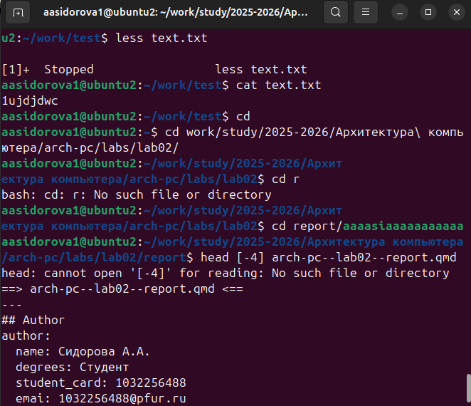

### Слайд 2

Потом с помощью команды tail просматриваю посление 6 строчек этого же файла. (рис.2)

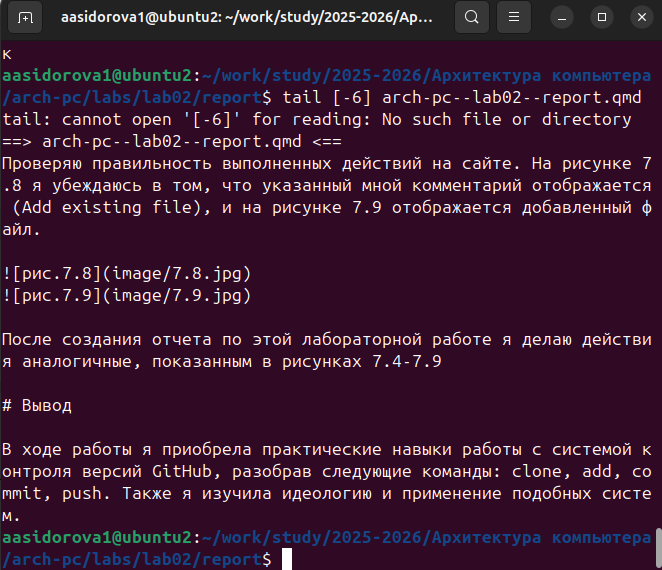 

### Слайд 3 

Перехожу в свой тестовый каталог, который был создан заранее. В нем я создаю файл abc1, потом копирую этот файл в файл april и его же копирую в may. Создаю директорию monthly. Копирую april и may в monthly. (рис.3) 

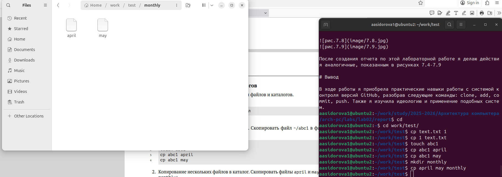 

### Слайд 4

Копирую файл monthly/may в файл с именем june и проверяю (рис.4)

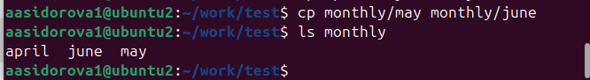

### Слайд 5 

Создаю директрию monthly.00. Копирую каталог monthly в каталог monthly.00. Копирую каталог monthly.00 в каталог /tmp (рис.5) 

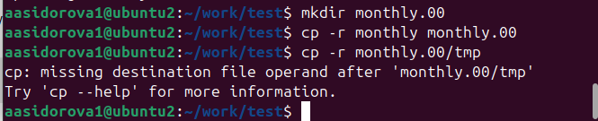
 
### Слайд 6

Изменяю название файла april на july в домашнем каталоге. Перемещаю файл july в каталог monthly.00. (рис.6) 

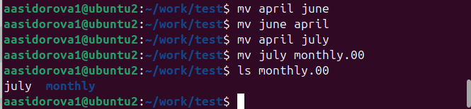 

### Слайд 7

Переименовываю каталог monthly.00 в monthly.01. Перемещаю каталог monthly.01в каталог reports. Переименовываю каталог reports/monthly.01 в reports/monthly. (рис.7)

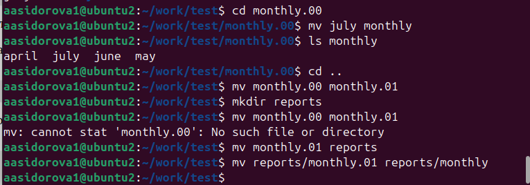

### Слайд 8

Создаю файл ~/may с правом выполнения для владельца и проверяю.  (рис.8) 

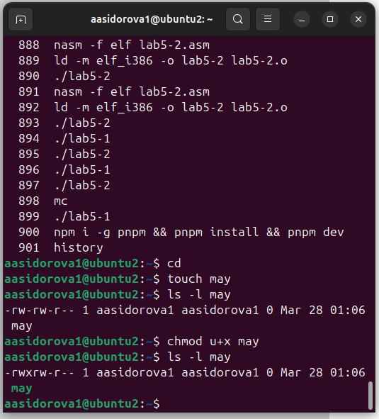

### Слайд 9

Лишаю владельца файла ~/may права на выполнение. Создаю каталог monthly с запретом на чтение для членов группы и всех остальных пользователей (на скрине не получилось, потом исправила с помощью числовых значаний). (рис.9)

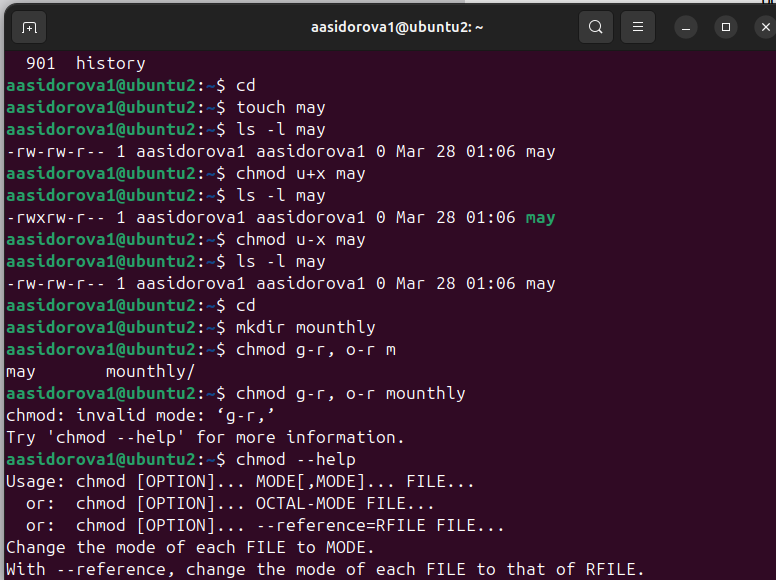

### Слайд 10

Создаю файл ~/abc1 с правом записи для членов группы. (рис.10)

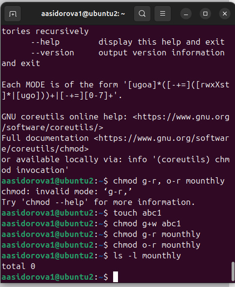

### Слайд 11

Использую команду mount, cat, df, fsck. (рис.11-13)

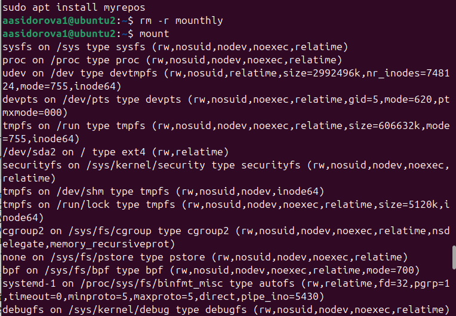

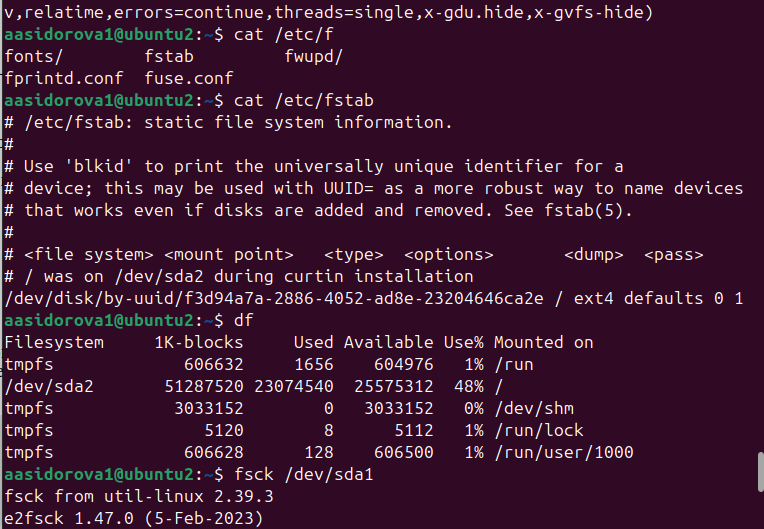

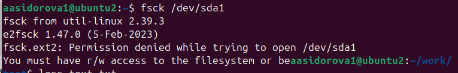

### Выполнение лабораторной 

Выполнение рабораторной работы пункт 2.1. Скопировала файл /usr/include/sound/sof/abi.h в домашний каталог и назвала его equipment. 2.2 в домашнем каталоге создала директорию ski.plases. 2.3 переместила файл equipment в каталог ~/ski.plases. 2.4 переименовала файл ~/ski.plases/equipment в ~/ski.plases/equiplist. 2.5 создала в домашнем каталоге файл abc1 и скопировала его в каталог ~/ski.plases, назвала его equiplist2. (рис.14)

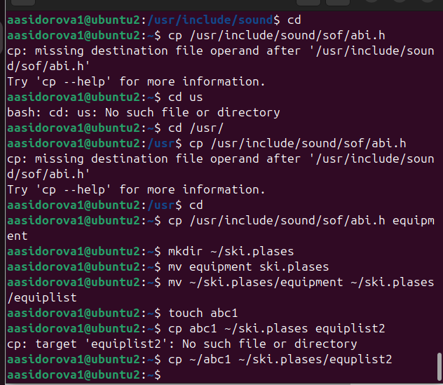

### Выполнение лабораторной 

2.7 Перемещаю файлы ~/ski.plases/equiplist и equiplist2 в каталог ~/ski.plases/equipment. 2.8 Создаю и перемещаю каталог ~/newdir в каталог ~/ski.plases и назовите его plans. (рис.15)

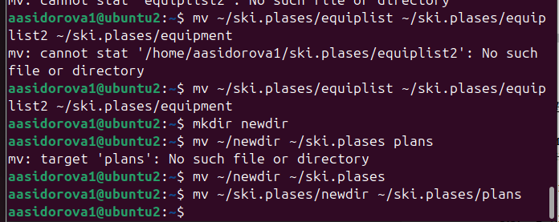

### Выполнение лабораторной 

Создаю необходимые файлы australia, play,my_os, feathers и с помощью команды chmod передаю им необходимые права доступа. (рис.16-17)

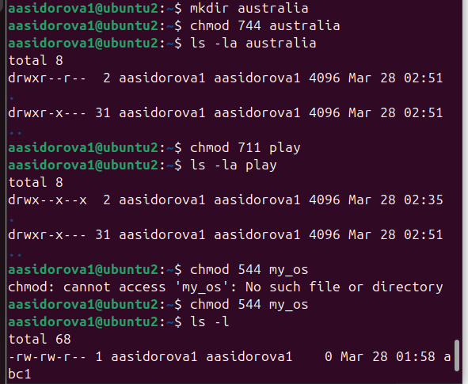

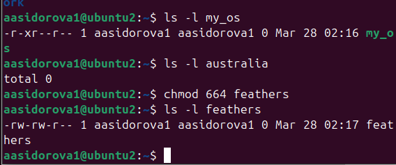

### Выполнение лабораторной 

4.1 Просматриваю содержимое файла /etc/password с помощью cat. (рис.18)

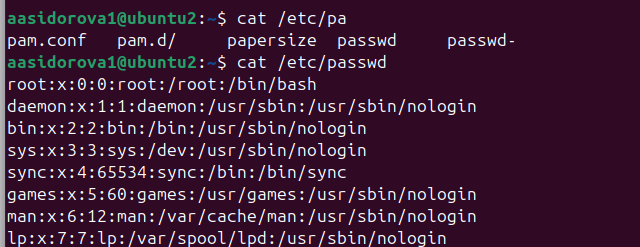

### Выполнение лабораторной 

4.2. Скопировала файл ~/feathers в файл ~/file.old. 4.3. Переместила файл ~/file.old в каталог ~/play. 4.4. Скопировала каталог ~/play в каталог ~/fun. 4.5. Переместила каталог ~/fun в каталог ~/play и назвала его games. 4.6. Лишила владельца файла ~/feathers права на чтение. 4.7. Если я попытаетесь просмотреть файл ~/feathers командой cat выдаст что в доступе отказано. 4.8. Если я  попытаетесь скопировать файл ~/feathers тоже в доступе отказано. 4.9. Даю владельцу файла ~/feathers право на чтение. 4.10. Лишаю владельца каталога ~/play права на выполнение. 4.11. Перехожу в каталог ~/play. Пишет что в доступе отказано. 4.12. Дайте владельцу каталога ~/play право на выполнение. (рис.19)

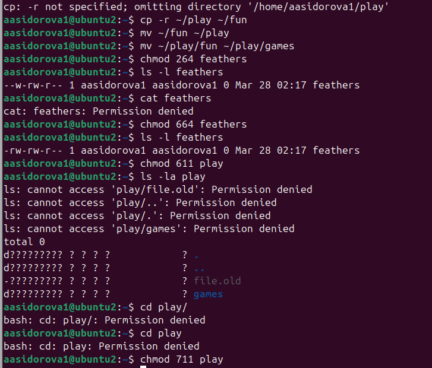

### Выполнение лабораторной 

Читаю man по командам mount, fsck, mkfs, kill. Mount не находит файл man. Fsck выдает информацию по использованию и по срочной помощи. Kill  выдает arguments must be process or job IDs. (рис.20)

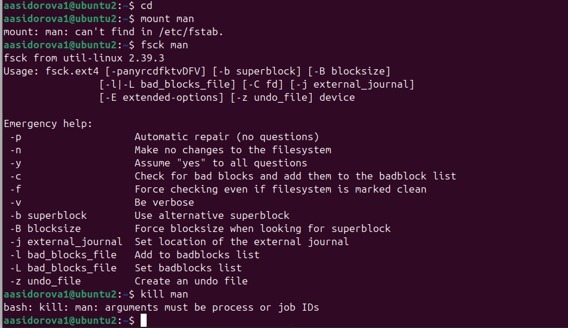

# Ответы на вопросы 

1. Характеристика основных файловых систем:

    NTFS (New Technology File System):
        Назначение: Стандартная ФС для Windows NT/10/11.

2.   / — корневой каталог, основа всей файловой иерархии.
    /bin — базовые исполняемые файлы для всех пользователей (ls, cp, mv и т. д.).

    /boot — файлы для загрузки ОС: ядро, загрузчик (GRUB), initrd.

    /dev — файлы устройств (жёсткие диски, терминалы, принтеры и т. д.).

    /etc — конфигурационные файлы системы и служб.

    /home — домашние каталоги обычных пользователей, личные файлы и настройки.

3. Команда mount подключает файловую систему к определённой точке в иерархии каталогов ОС (точке монтирования).

Точка монтирования — существующий каталог (например, /mnt/usb, /media/disk), через который будет доступен доступ к содержимому.

4. Причины нарушения целостности файловой системы: некорректное выключение, аппаратные сбои, вирусы, ошибки ПО, износ носителя.

Для устранения повреждений: в Windows используйте chkdsk /f /r, в Linux — fsck. Перед этим (если возможно) сделайте резервную копию данных.

5.  Файловая система создаётся с помощью специальной утилиты (например, mkfs в Linux или «Форматирование» в Windows) на разделе диска или на всём диске целиком. При этом задаётся тип файловой системы (ext4, NTFS, FAT32 и т. д.) и организуется структура для хранения данных. После создания её можно монтировать и использовать для записи файлов.

6.Кратко о командах для просмотра текстовых файлов:

    cat — выводит содержимое файла целиком на экран; подходит для небольших файлов.

    less — открывает файл постранично, позволяет листать и искать текст; удобен для больших файлов.

    head — показывает первые 10 строк файла (можно изменить число через -n).

    tail — показывает последние 10 строк файла (также поддерживает -n); с опцией -f отслеживает обновления в реальном времени.

    tac — выводит строки файла в обратном порядке (как cat наоборот). 

7. Команда cp в Linux копирует файлы и каталоги. Основные возможности:

    копирование отдельных файлов или групп по шаблону;

    рекурсивное копирование каталогов с помощью опции -r (--recursive);

    защита от случайной перезаписи (-i), обновление только более новых файлов (-u), сохранение атрибутов (-a) и другие опции для гибкого управления процессом.

8. Команда mv в Linux служит для перемещения и переименования файлов и каталогов.

Основные возможности:

    перемещение файлов/каталогов в другую директорию;

    переименование файлов/каталогов;

    перемещение нескольких объектов сразу;

9. Права доступа — это набор разрешений, определяющих, какие операции (чтение, запись, выполнение) могут выполнять пользователи с файлами и каталогами. В Linux они назначаются для владельца, группы и остальных пользователей.

Изменить права доступа можно с помощью команды chmod (например, chmod 755 file.txt или chmod u+rwx file.txt), а владельца и группу — командами chown и chgrp соответственно.

# Выводы

В ходе лабораторной работы я ознакомилась с файловой системой Linux, её структурой, именами и содержанием
каталогов, а также приобрела практические навыки по применению команд для работы
с файлами и каталогами, по управлению процессами (и работами), по проверке исполь-
зования диска и обслуживанию файловой системы.

