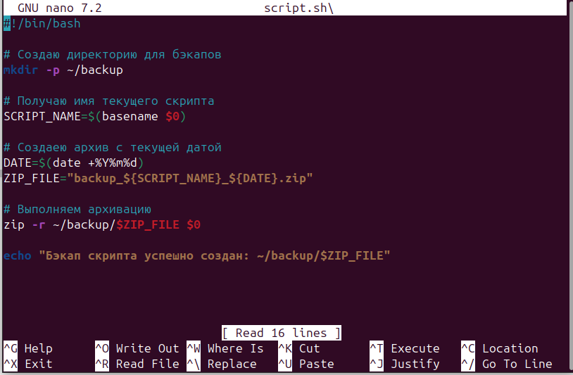
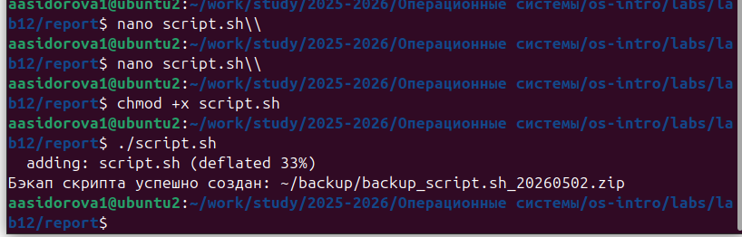
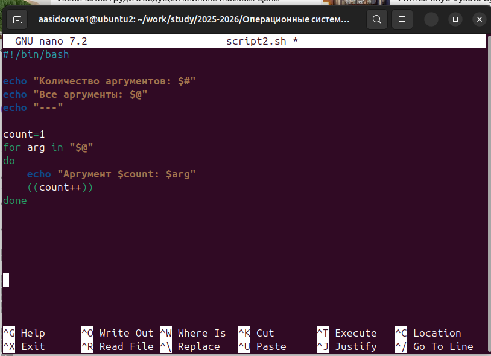
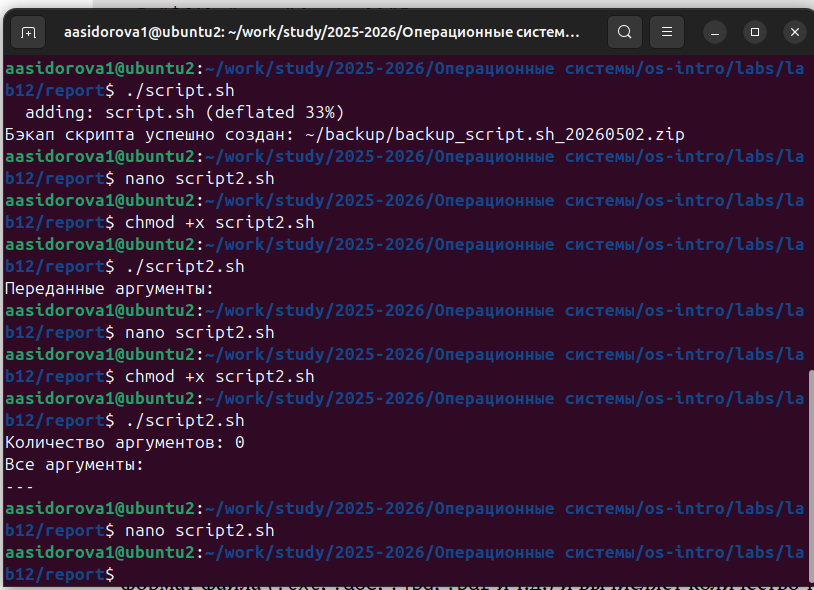
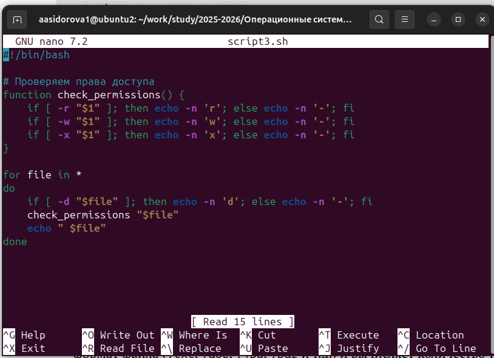
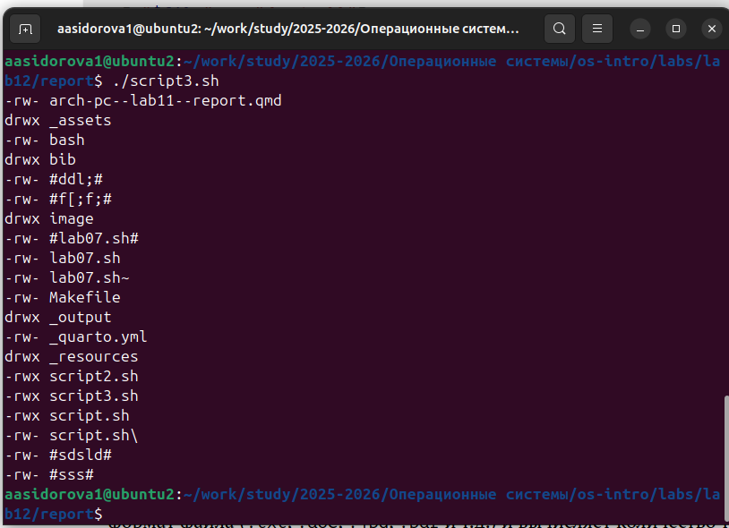
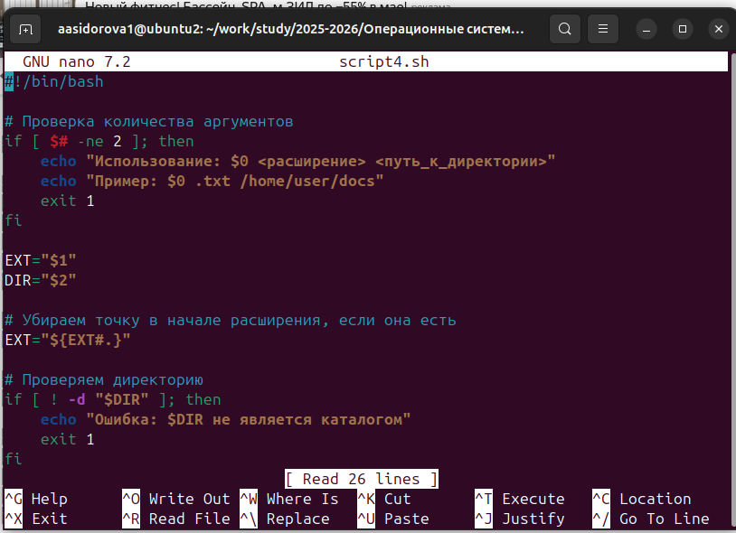
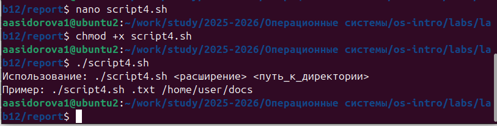

---
## Author
author:
  name: Сидорова Александра Андреевна
  email: 1032256488@rudn.ru
  affiliation:
    - name: Российский университет дружбы народов
      country: Российская Федерация
      postal-code: 117198
      city: Москва
      address: ул. Миклухо-Маклая, д. 6

## Title
title: "Лабораторная работа № 12"
subtitle: "Архитектура компьютера"
license: "НБИбд-01-25"
---

# Цель работы

Изучить основы программирования в оболочке ОС UNIX/Linux. Научиться писать небольшие командные файлы. 

# Задание

1. Написать скрипт, который при запуске будет делать резервную копию самого себя (то есть файла, в котором содержится его исходный код) в другую директорию backup в вашем домашнем каталоге. При этом файл должен архивироваться одним из архиваторов на выбор zip, bzip2 или tar. Способ использования команд архивации необходимо узнать, изучив справку.
2. Написать пример командного файла, обрабатывающего любое произвольное число аргументов командной строки, в том числе превышающее десять. Например, скрипт может последовательно распечатывать значения всех переданных аргументов.
3. Написать командный файл — аналог команды ls (без использования самой этой команды и команды dir). Требуется, чтобы он выдавал информацию о нужном каталоге и выводил информацию о возможностях доступа к файлам этого каталога.
4. Написать командный файл, который получает в качестве аргумента командной строки формат файла (.txt, .doc, .jpg, .pdf и т.д.) и вычисляет количество таких файлов в указанной директории. Путь к директории также передаётся в виде аргумента командной строки.

# Теоретическое введение

## Командные процессоры (оболочки)

Командный процессор (командная оболочка, интерпретатор команд shell) — это про-
грамма, позволяющая пользователю взаимодействовать с операционной системой
компьютера. В операционных системах типа UNIX/Linux наиболее часто используются
следующие реализации командных оболочек:
– оболочка Борна (Bourne shell или sh) — стандартная командная оболочка UNIX/Linux,
содержащая базовый, но при этом полный набор функций;
– С-оболочка (или csh) — надстройка на оболочкой Борна, использующая С-подобный
синтаксис команд с возможностью сохранения истории выполнения команд;
– оболочка Корна (или ksh) — напоминает оболочку С, но операторы управления програм-
мой совместимы с операторами оболочки Борна;
– BASH — сокращение от Bourne Again Shell (опять оболочка Борна), в основе своей сов-
мещает свойства оболочек С и Корна (разработка компании Free Software Foundation).
POSIX (Portable Operating System Interface for Computer Environments) — набор стандартов
описания интерфейсов взаимодействия операционной системы и прикладных программ.
Стандарты POSIX разработаны комитетом IEEE (Institute of Electrical and Electronics
Engineers) для обеспечения совместимости различных UNIX/Linux-подобных опера-
ционных систем и переносимости прикладных программ на уровне исходного кода.
POSIX-совместимые оболочки разработаны на базе оболочки Корна.
Рассмотрим основные элементы программирования в оболочке bash. В других оболоч-
ках большинство команд будет совпадать с описанными ниже. 

# Выполнение лабораторной работы

1. Я создаю скрипт, который при запуске будет делать резервную копию самого себя. Он создается в диреторию backup c помощью архиватора zip (~/backup/backup_script.sh_20260502.zip). С помощью команды chmod +x script.sh  изменяю код защиты этого командного файла, обеспечив доступ к этому файлу по выполнению. Потом я ввожу ./script.sh, чтобы выполнить файл.

2. Пишу скрипт для команного файла, обрабатывающего любое произвольное число аргументов командной строки, в том числе превышающее десять. Скрипт последовательно распечатывает значения всех переданных аргументов. С помощью команд как в предыдущем пункте изменяю код защиты файла и исполняю его.

3. Создаю командный файл — аналог команды ls. Он выдает информацию о нужном каталоге и выводит информацию о возможностях доступа к файлам этого каталога. С помощью команд как в первом шаге выполняю файл script3.sh.

4. Пишу командный файл, который получает в качестве аргумента командной строки формат файла (.txt, .doc, .jpg, .pdf ) и вычисляет количество таких файлов в указанной директории. Путь к директории также передаю в виде аргумента командной строки.

# Выводы

В ходе выполнения лабораторной работы были освоены: основы программирования в bash, работа с переменными и массивами, обработка параметров командной строки, создание и отладка скриптов, работа с файловой системой.

# Контрольные вопросы

1. Командная оболочка — программа-интерпретатор команд пользователя. Основные типы: sh, csh, ksh, bash.
2. POSIX — стандарт для обеспечения совместимости UNIX-подобных систем.
3. Переменные в bash определяются присваиванием значения, например: mark=/usr/andy/bin
4.  Операторы let и read: let — для арифметических вычислений, read — для чтения ввода.
5. Арифметические операции: +, -, *, /, %, битовые операции
6. Операция (( )) используется для арифметических выражений
7. Стандартные переменные: PATH, PS1, PS2, HOME, IFS, MAIL, TERM, LOGNAME
8. Метасимволы — специальные символы, имеющие особое значение в shell
9. Экранирование осуществляется символом \ или кавычками
10. Запуск скриптов: chmod +x имя_файла; ./имя_файла
11. Функции определяются через function имя { команды }
12. Проверка типа файла: test -d (каталог), test -f (обычный файл)
13. Команды set, typeset, unset управляют переменными и функциями
14. Параметры передаются через командную строку
15. Специальные переменные: $0-9(параметры),#, ∗,?, $$
